<div align="center">

# LOHEIDE.EU WP Rights Management

**Seiten, Dateien und den Verwaltungsbereich nach Anmeldung und WordPress-Rollen freigeben oder sperren.**

[](#)
[](#)
[](#)
[](#lizenz)
[](#tests)

Entwickelt von [LOHEIDE.EU](https://loheide.eu)

</div>

<div align="center">
  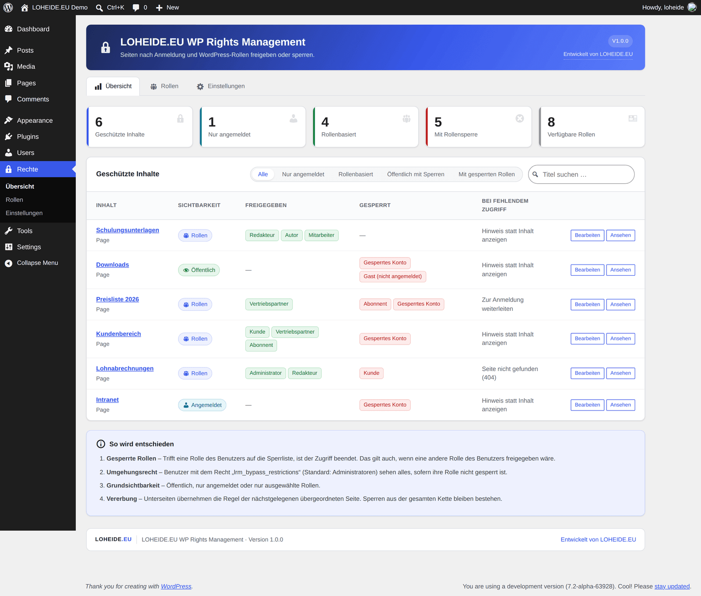
</div>

---

## Der Grundsatz: Sperren gewinnen immer

Die meisten Rechte-Plugins arbeiten nur mit Freigaben. Sobald ein Benutzer **mehrere Rollen** besitzt, wird das unübersichtlich – und im Zweifel zu großzügig.

Dieses Plugin dreht die Logik um: **Eine gesperrte Rolle beendet die Prüfung sofort.** Das gilt auch dann, wenn dieselbe Person über eine zweite, freigegebene Rolle verfügt.

| Benutzer hat die Rollen | Seitenregel | Ergebnis |
| --- | --- | --- |
| Abonnent | freigegeben: Abonnent | ✅ Zugriff |
| Abonnent + **Gesperrtes Konto** | freigegeben: Abonnent · gesperrt: Gesperrtes Konto | ⛔ **Kein Zugriff** |
| Administrator | keine Sperre | ✅ Zugriff über Umgehungsrecht |
| Administrator | **gesperrt: Administrator** | ⛔ **Kein Zugriff** |
| Gast (nicht angemeldet) | Modus „Nur angemeldet“ | ⛔ Weiterleitung zur Anmeldung |

> Die Sperre steht bewusst **vor** dem Umgehungsrecht der Administratoren. Wer eine Rolle ausdrücklich sperrt, meint es auch so. Der Zugang zum Backend bleibt davon unberührt – gesperrt wird ausschließlich die Ausgabe im Frontend.

---

## Inhalt

- [Funktionen](#funktionen)
- [Screenshots](#screenshots)
- [Installation](#installation)
- [Bedienung](#bedienung)
- [Auswertungsreihenfolge](#auswertungsreihenfolge)
- [Vererbung auf Unterseiten](#vererbung-auf-unterseiten)
- [Dateien im Uploads-Ordner](#dateien-im-uploads-ordner)
- [Rechte im Verwaltungsbereich](#rechte-im-verwaltungsbereich)
- [Einstellungen](#einstellungen)
- [Shortcodes](#shortcodes)
- [Für Entwickler](#für-entwickler)
- [Tests](#tests)
- [Betrieb](#betrieb)
- [Grenzen](#grenzen)
- [Mögliche Erweiterungen](#mögliche-erweiterungen)
- [Datenhaltung](#datenhaltung)

---

## Funktionen

| | |
| --- | --- |
| 🔒 **Drei Sichtbarkeitsmodi** | Öffentlich · Nur angemeldet · Nur ausgewählte Rollen |
| ⛔ **Sperrliste mit Vorrang** | Wirkt in **jedem** Modus – auch auf öffentlichen Seiten |
| 👤 **Virtuelle Rolle „Gast“** | Nicht angemeldete Besucher sind wie eine Rolle adressierbar |
| 🧩 **Nur WordPress-Rollen** | Keine eigene Rollenwelt. Rollen aus anderen Plugins erscheinen automatisch |
| 🌳 **Vererbung** | Unterseiten übernehmen die Regel; Sperren der Kette bleiben bestehen |
| 🚪 **Vier Reaktionen** | Hinweis mit Anmeldeformular · Anmeldung · eigene Adresse · 404 |
| 👁️ **Konsequent versteckt** | Menüs, Seitenlisten, Suche, Archive, Feeds, XML-Sitemap, REST-API |
| 📊 **Übersicht & Simulation** | Kennzahlen, Rollenmatrix und „Was sieht Rolle X?“ auf Knopfdruck |
| ⚡ **Sammelbearbeitung** | Rechte für viele Seiten in einem Schritt setzen |
| 📁 **Dateischutz** | Genereller Block für den Uploads-Ordner, Whitelist und Regeln je Datei |
| 🛠️ **Backend-Rechte** | Rollen nur bestimmte Seiten und Kategorien bearbeiten lassen, Menüpunkte je Rolle |
| 🧱 **Shortcodes** | Einzelne Abschnitte innerhalb einer Seite schützen |

---

## Screenshots

> Alle Aufnahmen stammen aus einer laufenden WordPress-Installation mit Demo-Inhalten.

### Bereich „Zugriffsrechte“ im Editor

Freigaben links, Sperren rechts. Eine Rolle in beiden Listen wird durchgestrichen – das Verbot gewinnt. Unter der Auswahl steht jederzeit das Ergebnis im Klartext.

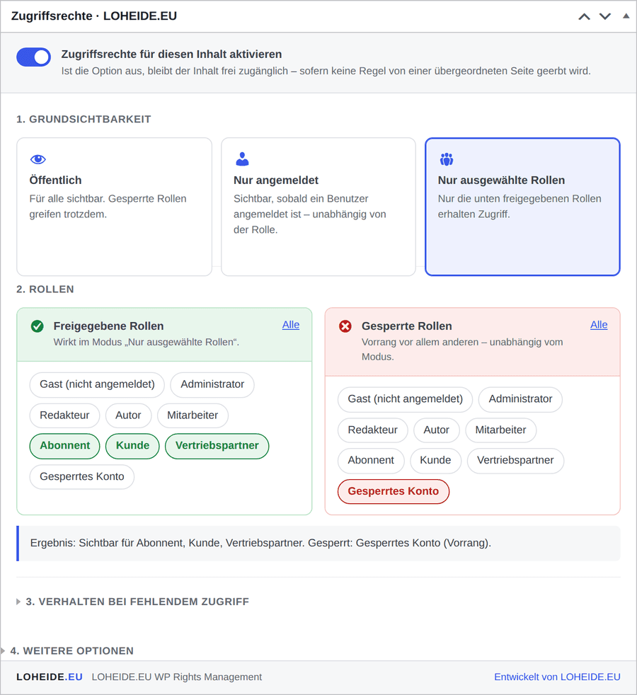

### Geerbte Sperren sind sichtbar

Eine Unterseite kann Sperren der übergeordneten Seite **nicht** aufheben. Das Plugin weist sie daher ausdrücklich aus:

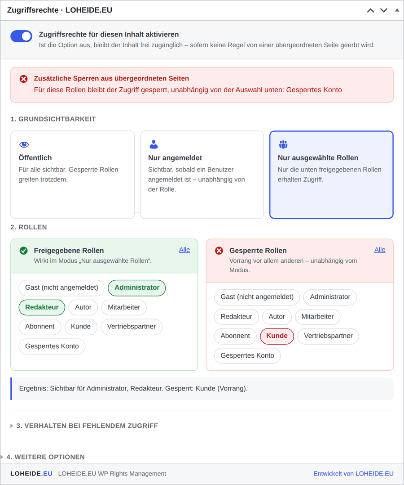

### In der Editor-Seitenleiste

Standardmäßig sitzt der Bereich in der Seitenleiste – dort ist er auch im Block-Editor sofort sichtbar, ohne die untere Metabox-Leiste aufziehen zu müssen.

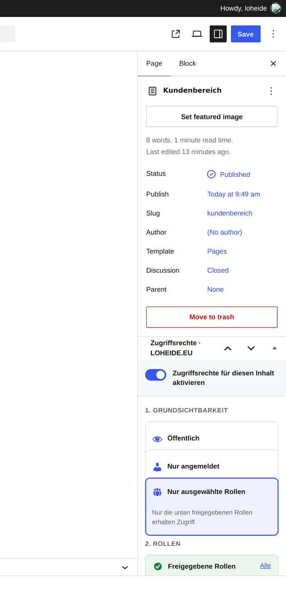

### Rollen im Überblick und Zugriffssimulation

Welche Rolle ist wo freigegeben, wo gesperrt? Und was sieht sie tatsächlich – inklusive Begründung je Seite:

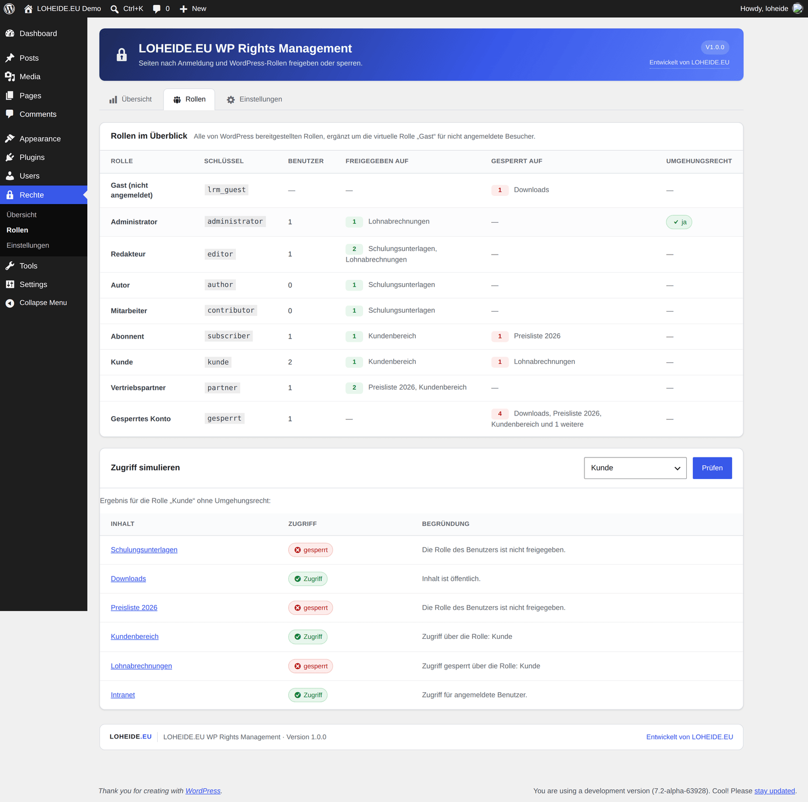

### Backend-Rechte je Rolle

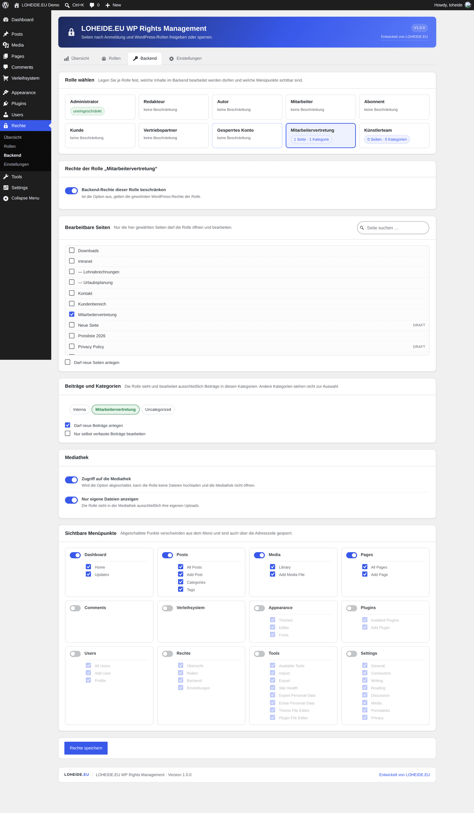

### Dateischutz mit Whitelist und Selbsttest

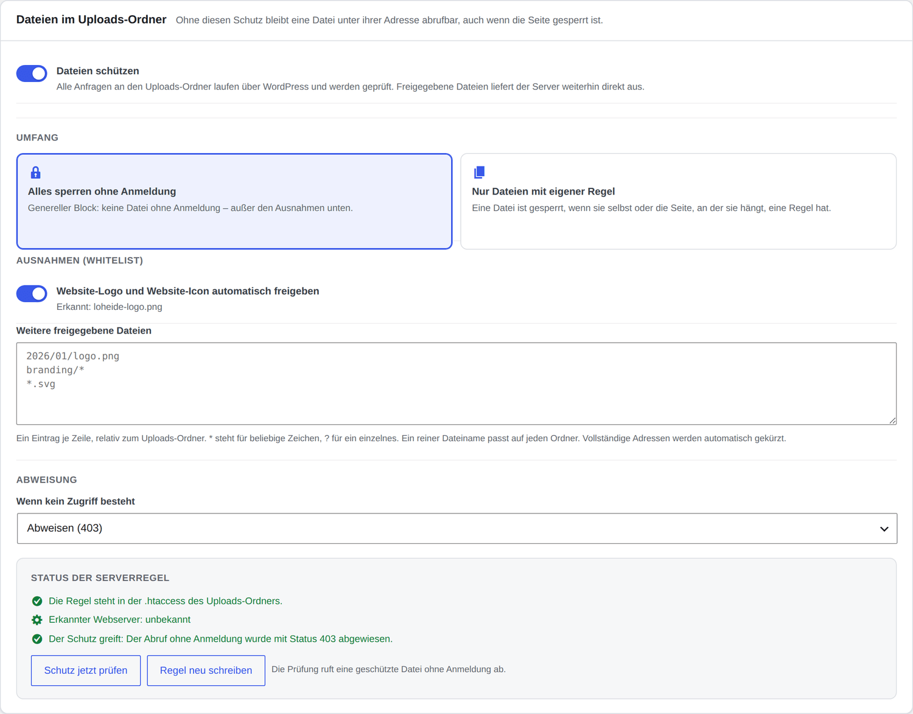

### Einstellungen

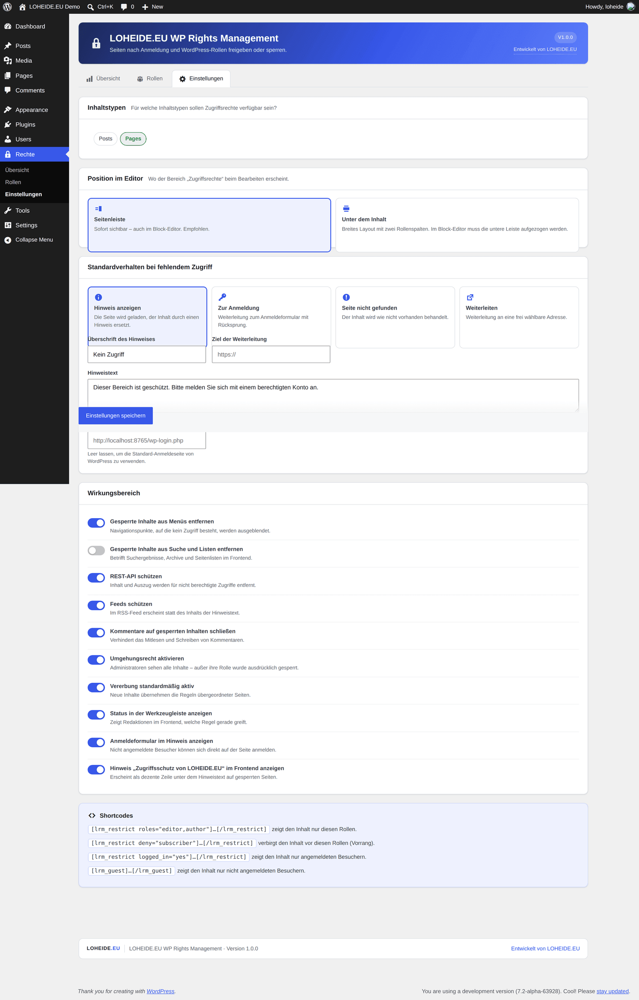

### Zugriff je Datei in der Medienbibliothek

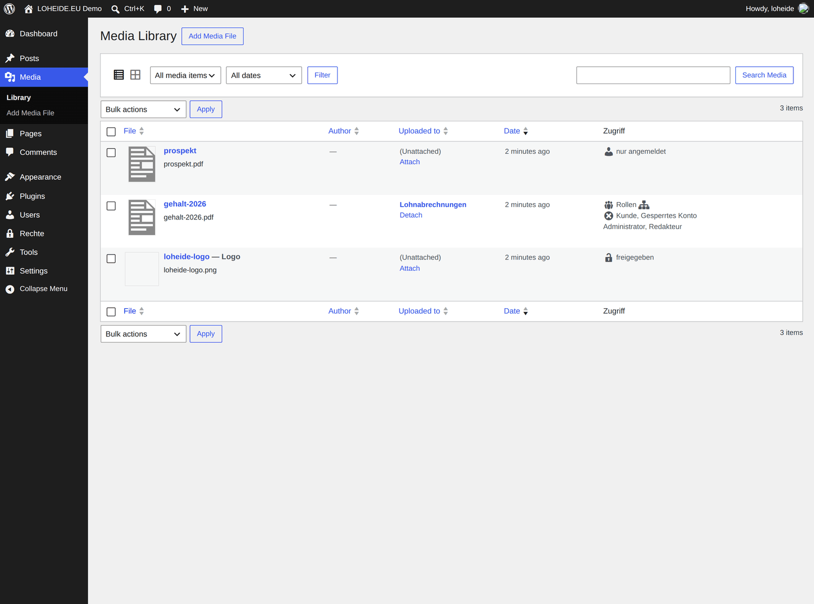

### Statusspalte in der Seitenliste

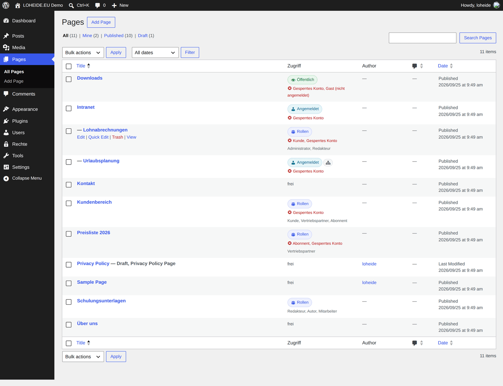

### Was Besucher sehen

<table>
<tr>
<td width="50%">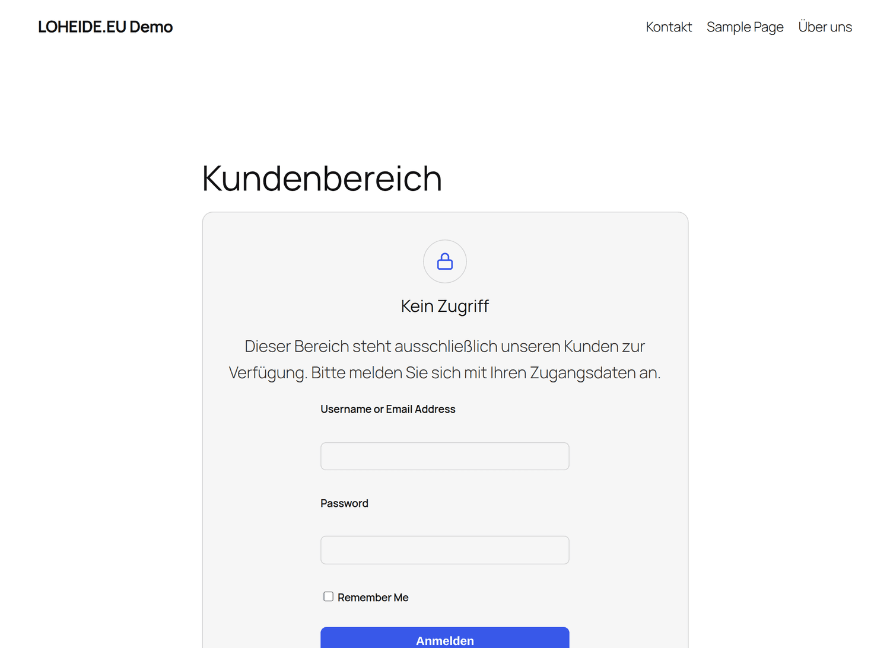</td>
<td width="50%">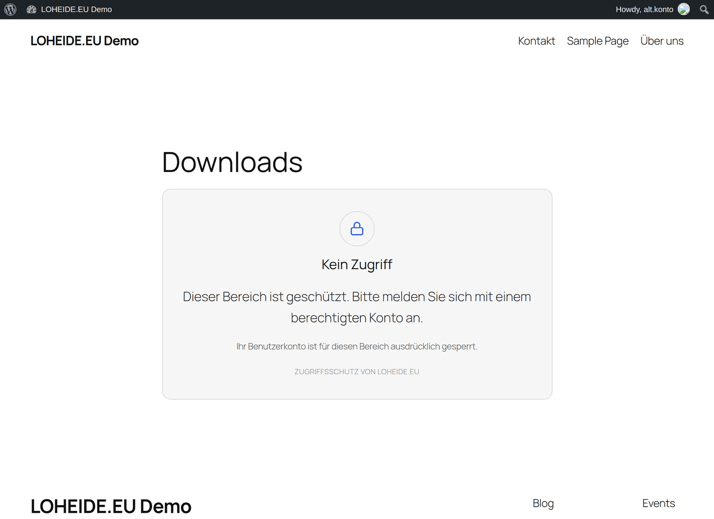</td>
</tr>
<tr>
<td><b>Gast</b> auf einer geschützten Seite – mit Anmeldeformular und eigenem Hinweistext.</td>
<td><b>Gesperrte Rolle</b> auf einer <i>öffentlichen</i> Seite. Die Sperre greift trotzdem, und die Seite verschwindet aus der Navigation.</td>
</tr>
</table>

---

## Installation

```bash
cd wp-content/plugins
git clone https://github.com/friloo/LOHEIDE.EU-WP-Rights-Management.git loheide-rights-management
```

Alternativ das Verzeichnis als ZIP hochladen. Danach:

1. Unter **Plugins** aktivieren.
2. **Rechte → Einstellungen** öffnen und die Inhaltstypen wählen (Voreinstellung: Seiten).
3. Eine Seite bearbeiten und im Bereich **Zugriffsrechte** die Regel setzen.
4. Sollen auch Dateien geschützt sein: im selben Fenster **Dateien schützen**
   einschalten und anschließend **„Schutz jetzt prüfen"** anklicken.

Bei der Aktivierung erhält die Rolle *Administrator* die Fähigkeiten `lrm_manage_permissions` (Verwaltung) und `lrm_bypass_restrictions` (Umgehungsrecht).

**Voraussetzungen:** WordPress 5.8+, PHP 7.4+. Keine Abhängigkeiten, kein Build-Schritt.

---

## Bedienung

<table>
<tr><td width="34"><b>1</b></td><td><b>Zugriffsrechte aktivieren</b><br>Hauptschalter. Ist er aus, bleibt die Seite frei zugänglich – sofern keine Regel geerbt wird.</td></tr>
<tr><td><b>2</b></td><td><b>Grundsichtbarkeit wählen</b><br><i>Öffentlich</i>, <i>Nur angemeldet</i> oder <i>Nur ausgewählte Rollen</i>.</td></tr>
<tr><td><b>3</b></td><td><b>Rollen setzen</b><br>Links freigeben, rechts sperren. Konflikte werden markiert, die Sperre gewinnt.</td></tr>
<tr><td><b>4</b></td><td><b>Reaktion festlegen</b> <i>(optional)</i><br>Pro Seite überschreibbar, sonst gilt die globale Einstellung.</td></tr>
<tr><td><b>5</b></td><td><b>Vererbung steuern</b> <i>(optional)</i><br>Regeln übergeordneter Seiten übernehmen und/oder an Unterseiten weitergeben.</td></tr>
</table>

**Mehrere Seiten auf einmal:** In der Seitenliste mehrere Einträge markieren → *Aktion wählen → Bearbeiten → Übernehmen*. Dort lassen sich Modus und Rollen für alle markierten Seiten setzen.

**Wer darf bearbeiten?** Das steht unter
[Rechte im Verwaltungsbereich](#rechte-im-verwaltungsbereich) – dort wird je Rolle
festgelegt, welche Seiten und Kategorien im Backend zugänglich sind.

**Für Dateien** gilt dasselbe Fenster: In der Medienbibliothek steht das Feld
**Zugriff**, im Bearbeitungsfenster einer Datei der vollständige Bereich mit
Rollen und Sperren. Meist braucht es das gar nicht – eine Datei erbt die Regel
der Seite, in die sie hochgeladen wurde. Näheres unter
[Dateien im Uploads-Ordner](#dateien-im-uploads-ordner).

---

## Auswertungsreihenfolge

```text
┌─ 1. Hat der Benutzer eine gesperrte Rolle? ──────────── ⛔ Zugriff verweigert
│      (hat immer Vorrang – auch gegen das Umgehungsrecht)
│
├─ 2. Darf der Benutzer Beschränkungen umgehen? ───────── ✅ Zugriff erlaubt
│      (Fähigkeit lrm_bypass_restrictions, Standard: Administrator)
│
├─ 3. Ist überhaupt eine Regel aktiv? ─────────── nein → ✅ Zugriff erlaubt
│
└─ 4. Grundsichtbarkeit
       ├─ öffentlich ───────────────────────────────────  ✅ Zugriff erlaubt
       ├─ nur angemeldet ──── angemeldet? ───────────────  ✅ / ⛔
       └─ nur Rollen ──────── eine Rolle freigegeben? ───  ✅ / ⛔
```

Jede Entscheidung trägt eine Begründung, die in der Simulation und – für Verwalter – im Frontend-Hinweis sichtbar ist.

---

## Vererbung auf Unterseiten

- Eine Unterseite **ohne** eigene Regel übernimmt die Regel der nächstgelegenen übergeordneten Seite.
- **Sperren werden über die gesamte Seitenkette gesammelt.** Eine Unterseite kann eine Sperre der übergeordneten Seite nicht aufheben – auch nicht mit einer eigenen Regel.
- Die übergeordnete Seite kann die Weitergabe abschalten („Diese Regel auch für Unterseiten anwenden“).
- Die Unterseite kann die Übernahme abschalten („Regeln übergeordneter Seiten übernehmen“). Dann entfallen auch die geerbten Sperren.

```text
Intranet                    Regel: nur angemeldet · gesperrt: Gesperrtes Konto
└── Lohnabrechnungen        eigene Regel: nur Administrator, Redakteur
                            ⇒ wirksam: Administrator + Redakteur,
                               zusätzlich gesperrt: Gesperrtes Konto (geerbt)
```

---

## Dateien im Uploads-Ordner

Eine gesperrte Seite nützt wenig, wenn das PDF darauf weiterhin unter seiner
Adresse abrufbar ist. Der Webserver liefert solche Dateien aus, ohne WordPress
zu starten. Das Plugin schiebt deshalb eine Prüfung davor.

### Einschalten

**Rechte → Einstellungen → Dateien im Uploads-Ordner → „Dateien schützen"**

Dabei schreibt das Plugin eine Regel in die `.htaccess` des Uploads-Ordners:
Anfragen laufen über WordPress, freigegebene Dateien liefert der Server
weiterhin direkt aus. Für nginx steht die passende Regel zum Kopieren bereit.

### Zwei Betriebsarten

| Umfang | Bedeutung |
| --- | --- |
| **Alles sperren ohne Anmeldung** | Genereller Block. Keine Datei ohne Anmeldung – außer den Ausnahmen. |
| **Nur Dateien mit eigener Regel** | Eine Datei ist gesperrt, wenn sie selbst oder die Seite, an der sie hängt, eine Regel hat. |

### Ausnahmen (Whitelist)

Das Website-Logo und das Website-Icon werden auf Wunsch **automatisch**
freigegeben – sie werden auf der Anmeldeseite gebraucht und dürfen nicht hinter
dem Schutz liegen. Weitere Ausnahmen kommen als Muster dazu, eines je Zeile:

```
2026/01/logo.png      # genau diese Datei
briefkopf.png         # diese Datei in jedem Ordner
branding/*            # alles in diesem Ordner
*.svg                 # alle Dateien dieses Typs
```

Ein Muster ohne Ordnerangabe passt in jedem Ordner – damit lassen sich auch die
von WordPress erzeugten Bildgrößen mit einem Eintrag freigeben (`logo*.png`).

### Rechte je Datei

Dateien sind Inhalte wie jede Seite: In der Medienbibliothek steht das Feld
**Zugriff**, im Bearbeitungsfenster der Datei der vollständige Bereich mit
Rollen und Sperren. Zusätzlich gilt:

> Eine Datei erbt die Regel der Seite, in die sie hochgeladen wurde. Das PDF auf
> einer gesperrten Seite ist damit ohne weiteres Zutun ebenfalls gesperrt.

Und wie überall: **Eine gesperrte Rolle erhält die Datei nicht**, auch wenn eine
zweite Rolle sie freigeben würde.

### Prüfen, ob es wirkt

Der Knopf **„Schutz jetzt prüfen"** ruft eine geschützte Datei ohne Anmeldung ab
und meldet das Ergebnis. So ist sofort erkennbar, ob die Serverregel greift –
gerade bei nginx oder abweichenden Hosting-Konfigurationen.

### Was geprüft wird

Jede Anfrage durchläuft in dieser Reihenfolge:

```text
1. Liegt die Datei wirklich im Uploads-Ordner?   (sonst 404 – kein ../ Ausbruch)
2. Ist es eine ausführbare Datei (.php & Co.)?   (dann niemals ausliefern)
3. Steht sie auf der Ausnahmeliste?              → ✅ ausliefern
4. Hat sie – oder ihre Seite – eine Regel?       → Sperren gewinnen
5. Genereller Block und nicht angemeldet?        → ⛔ 403 oder Anmeldung
```

Ausgeliefert wird mit korrektem Dateityp, `nosniff`, `noindex` und Unterstützung
für Teilabrufe (Videos, große PDFs).

---

## Rechte im Verwaltungsbereich

Die bisherigen Regeln bestimmen, wer etwas **sehen** darf. Dieser Teil bestimmt,
wer etwas **bearbeiten** darf – und was er dabei überhaupt zu Gesicht bekommt.

Der Anlass aus der Praxis: Die Mitarbeitervertretung pflegt ihre eigene Seite und
schreibt Berichte in ihrer eigenen Kategorie. Sie soll genau das tun können –
und sonst nichts sehen.

**Rechte → Backend**, dort die Rolle wählen:

| Einstellung | Wirkung |
| --- | --- |
| **Bearbeitbare Seiten** | Nur diese Seiten darf die Rolle öffnen. Alle anderen erscheinen nicht einmal in der Liste. |
| **Kategorien** | Die Rolle sieht und bearbeitet ausschließlich Beiträge dieser Kategorien. Andere Kategorien stehen nicht zur Auswahl – auch nicht im Block-Editor. |
| **Neue Inhalte anlegen** | Getrennt für Seiten und Beiträge. Ein neuer Beitrag erhält automatisch die freigegebene Kategorie. |
| **Nur selbst verfasste Beiträge** | Schränkt zusätzlich auf die eigenen Beiträge ein. |
| **Mediathek** | Zugriff ganz abschalten oder auf die eigenen Uploads begrenzen. |
| **Sichtbare Menüpunkte** | Je Rolle festlegen, welche Menüs und Untermenüs erscheinen – auch die anderer Plugins. |

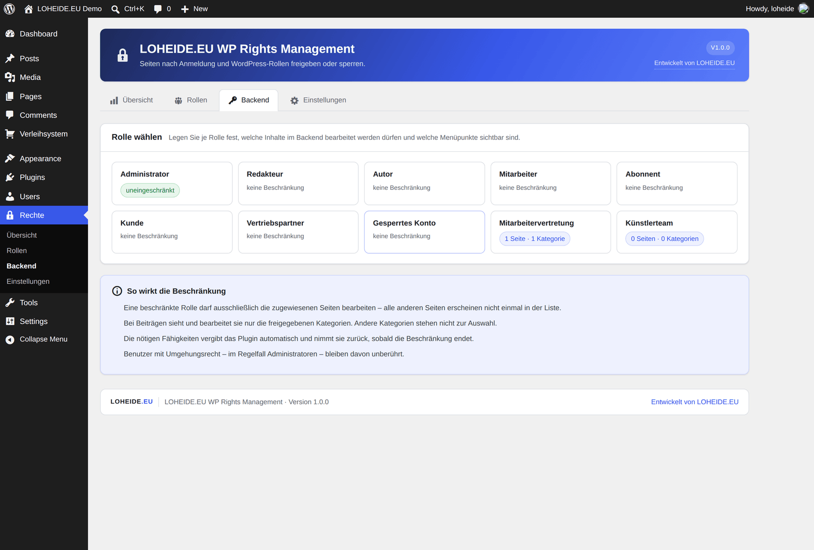

### So sieht es die beschränkte Rolle

Links das gewohnte Menü, hier auf das Nötige zusammengeschrumpft – und in der
Seitenliste steht genau eine Seite:

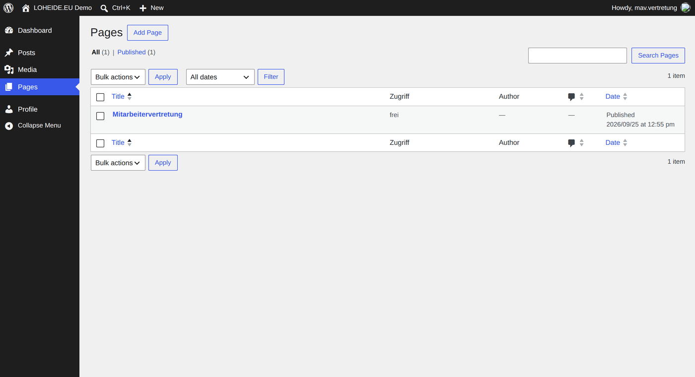

### Zwei Beispiele

**Mitarbeitervertretung:** Seite „Mitarbeitervertretung" zugewiesen, Kategorie
„Mitarbeitervertretung" freigegeben, neue Beiträge erlaubt, neue Seiten nicht.
Menüs auf Dashboard, Beiträge, Medien und Seiten reduziert.

**Künstlerteam:** Keine Seiten, keine Kategorien – dafür bleibt als einziger
inhaltlicher Menüpunkt das Verleihsystem stehen. Alle anderen Rollen sehen es
nicht, Administratoren schon.

### Fähigkeiten werden mitgeführt

Damit eine Rolle eine fremde Seite bearbeiten kann, braucht sie in WordPress
zunächst das allgemeine Recht dazu (`edit_others_pages`). Das Plugin vergibt
solche Fähigkeiten automatisch und begrenzt sie anschließend auf die
zugewiesenen Inhalte. Endet die Beschränkung, nimmt es sie wieder zurück –
Fähigkeiten, welche die Rolle schon vorher besaß, bleiben unangetastet.

> [!IMPORTANT]
> Aus demselben Grund entzieht das Plugin diese Fähigkeiten auch beim
> **Deaktivieren**. Andernfalls dürfte die Rolle ohne die begrenzende Prüfung
> plötzlich alle Seiten bearbeiten.

### Nicht nur ausgeblendet, sondern gesperrt

Ein verborgener Menüpunkt allein ist kein Schutz. Jede Beschränkung wird
zusätzlich serverseitig geprüft:

```text
Bearbeiten eines Inhalts  → map_meta_cap gibt „do_not_allow" zurück
Listen im Backend         → auf die zugewiesenen Inhalte eingegrenzt
Aufruf per Adresszeile    → gesperrte Verwaltungsseiten antworten mit 403
REST-Schnittstelle        → Bearbeiten fremder Inhalte wird abgewiesen,
                            Neuanlage ohne Erlaubnis ebenso,
                            Kategorien werden beim Speichern zurückgesetzt
```

Der letzte Punkt ist wichtig: Der Block-Editor arbeitet über die REST-Schnittstelle.
Prüfungen, die nur im Verwaltungsbereich greifen, wären dort wirkungslos.

### Mehrere Rollen

Hat jemand zwei beschränkte Rollen, werden deren Freigaben zusammengeführt.
Sobald **eine** Rolle beschränkt ist, gilt die Beschränkung – nur das
Umgehungsrecht (im Regelfall Administratoren) hebt sie auf.

---

## Einstellungen

| Einstellung | Standard | Wirkung |
| --- | --- | --- |
| Inhaltstypen | Seiten | Für welche Typen der Bereich erscheint |
| Position im Editor | Seitenleiste | Seitenleiste (sofort sichtbar) oder breit unter dem Inhalt |
| Standardverhalten | Hinweis anzeigen | Hinweis · Anmeldung · 404 · Weiterleitung |
| Überschrift & Hinweistext | „Kein Zugriff“ | Global, pro Seite überschreibbar |
| Eigene Anmeldeseite | – | Leer = Standard-Anmeldung von WordPress |
| Aus Menüs entfernen | an | Navigationspunkte ohne Zugriff ausblenden |
| Aus Suche und Listen entfernen | aus | Suchergebnisse, Archive, Seitenlisten |
| REST-API schützen | an | Inhalt und Auszug werden entfernt |
| Feeds schützen | an | Statt des Inhalts erscheint der Hinweistext |
| Kommentare schließen | an | Auf gesperrten Inhalten |
| Umgehungsrecht | an | Administratoren sehen alles – außer ihre Rolle ist gesperrt |
| Vererbung standardmäßig | an | Für neu angelegte Inhalte |
| Status in der Werkzeugleiste | an | Zeigt Redaktionen die wirksame Regel im Frontend |
| Anmeldeformular im Hinweis | an | Direkte Anmeldung auf der gesperrten Seite |
| Hinweis „Zugriffsschutz von LOHEIDE.EU“ | an | Dezente Zeile unter dem Hinweistext |
| Dateien schützen | aus | Prüfung für den Uploads-Ordner einschalten |
| Umfang des Dateischutzes | Alles ohne Anmeldung | Genereller Block oder nur Dateien mit Regel |
| Logo automatisch freigeben | an | Website-Logo und -Icon bleiben öffentlich |
| Ausnahmen | – | Weitere freigegebene Dateien als Muster |
| Abweisung bei Dateien | 403 | Abweisen oder zur Anmeldung leiten |

---

## Shortcodes

Für einzelne Abschnitte **innerhalb** einer Seite:

```
[lrm_restrict roles="editor,author"]Nur für Redakteure und Autoren.[/lrm_restrict]

[lrm_restrict deny="subscriber"]Für Abonnenten unsichtbar.[/lrm_restrict]

[lrm_restrict logged_in="yes"]Nur für angemeldete Besucher.[/lrm_restrict]

[lrm_restrict roles="kunde" message="Bitte melden Sie sich an."]Kundenpreise[/lrm_restrict]

[lrm_guest]Nur für nicht angemeldete Besucher.[/lrm_guest]
```

Auch hier schlägt `deny` jedes `roles`.

---

## Für Entwickler

| Hook | Typ | Zweck |
| --- | --- | --- |
| `lrm_selectable_roles` | Filter | Auswählbare Rollen ergänzen oder entfernen |
| `lrm_user_roles` | Filter | Rollen, mit denen ein Benutzer geprüft wird |
| `lrm_effective_rule` | Filter | Wirksame Regel eines Inhalts anpassen |
| `lrm_check_access` | Filter | Prüfergebnis überschreiben |
| `lrm_protected_post_types` | Filter | Geschützte Inhaltstypen |
| `lrm_denied_action` | Filter | Reaktion bei verweigertem Zugriff |
| `lrm_denied_notice` | Filter | HTML der Hinweisbox |
| `lrm_file_access` | Filter | Entscheidung über eine einzelne Datei |
| `lrm_uploads_whitelist` | Filter | Ausnahmeliste des Dateischutzes |
| `lrm_branding_attachments` | Filter | Anhänge, die immer öffentlich bleiben |
| `lrm_file_denied` | Action | Eine Datei wurde abgewiesen |
| `lrm_backend_user_config` | Filter | Wirksame Backend-Regel eines Benutzers |
| `lrm_backend_allowed_pages` | Filter | Bearbeitbare Seiten einer Rolle |
| `lrm_backend_can_edit_post` | Filter | Entscheidung für weitere Inhaltstypen |
| `lrm_backend_required_caps` | Filter | Fähigkeiten, die eine beschränkte Rolle erhält |
| `lrm_loaded` | Action | Plugin vollständig geladen |

<details>
<summary><b>Beispiel: eigene Prüfung ergänzen</b></summary>

```php
add_filter( 'lrm_check_access', function ( $result, $post_id, $user ) {
	// Support-Konten sehen alles – sofern sie nicht gesperrt sind.
	if ( 'denied_role' === $result['reason'] ) {
		return $result; // Sperre nicht aushebeln.
	}

	if ( $user && in_array( 'support', (array) $user->roles, true ) ) {
		$result['allowed'] = true;
		$result['reason']  = 'bypass';
	}

	return $result;
}, 10, 3 );
```

</details>

<details>
<summary><b>Beispiel: Zugriff im Theme prüfen</b></summary>

```php
if ( class_exists( 'LRM_Access' ) && ! LRM_Access::can_view( $post_id ) ) {
	echo '<p>Dieser Beitrag ist geschützt.</p>';
}

// Mit Begründung:
$check = LRM_Access::check( $post_id );
echo esc_html( LRM_Access::reason_text( $check ) );
```

</details>

---

## Tests

Die Zugriffslogik läuft ohne WordPress-Installation:

```bash
php tests/test-access.php   # Zugriffslogik
php tests/test-media.php    # Dateischutz
php tests/test-backend.php  # Backend-Rechte
```

```
1) Gesperrte Rolle hat Vorrang
  OK   Abonnent + gesperrte Rolle "kunde" erhält keinen Zugriff
  OK   Begründung ist die Rollensperre
  …
Alle 34 Prüfungen erfolgreich.
```

Abgedeckt sind der Vorrang der Sperrliste, das Umgehungsrecht, die virtuelle
Gast-Rolle, alle drei Sichtbarkeitsmodi, die Vererbung über mehrere Seitenebenen
sowie die Bereinigung ungültiger Eingaben.

Der zweite Satz (36 Prüfungen) deckt den Dateischutz ab: Mustervergleich der
Ausnahmeliste, Vererbung vom übergeordneten Inhalt auf den Anhang und die Abwehr
von Pfadmanipulationen – darunter `../`, URL-kodierte Varianten, Nullbytes und
der Versuch, `wp-config.php` oder eine PHP-Datei ausliefern zu lassen.

Der dritte Satz (32 Prüfungen) deckt die Backend-Rechte ab: Zuweisung von Seiten,
Kategoriebindung bei Beiträgen, Mediathek, das Vergeben und Zurücknehmen der
Fähigkeiten sowie die Zusammenführung mehrerer Rollen.

---

## Betrieb

> [!IMPORTANT]
> **Caching:** Geschützte Seiten dürfen nicht als statische Kopie für alle Besucher ausgeliefert werden. Das Plugin setzt `nocache_headers()` und die Konstanten `DONOTCACHEPAGE`, `DONOTCACHEOBJECT` und `DONOTCACHEDB`. Die meisten Caching-Plugins beachten das – prüfen Sie es nach der Einrichtung mit einem Testkonto.

> [!NOTE]
> **Statuscodes:** Gesperrte Seiten antworten mit `403` (Hinweis) beziehungsweise `404`. Suchmaschinen nehmen sie damit nicht in den Index; zusätzlich werden sie aus der XML-Sitemap entfernt.

---

## Grenzen

Damit klar ist, was das Plugin **nicht** leistet:

- **Dateischutz braucht die passende Serverregel.** Bei Apache schreibt das Plugin sie selbst; bei nginx muss sie einmalig von Hand eingetragen werden. Der Selbsttest zeigt, ob sie greift.
- **Eine Datei erbt nur von der Seite, in die sie hochgeladen wurde** (`post_parent`). Wird dieselbe Datei später auf einer anderen, strenger geschützten Seite eingebunden, greift deren Regel nicht automatisch – dann braucht die Datei eine eigene Regel.
- **Geschützte Dateien laufen über PHP.** Das kostet etwas Leistung. Freigegebene Dateien und alles außerhalb des Uploads-Ordners bleiben davon unberührt.
- **Keine Zeitsteuerung** (Zugriff ab/bis Datum) und **keine Rechte für einzelne Benutzer** – ausschließlich Rollen.
- **Sitemaps von SEO-Plugins** (Yoast, Rank Math) verwenden eigene Abfragen; nur die WordPress-eigene Sitemap wird gefiltert.
- **Mehrsprachigkeit:** Übersetzte Seiten (WPML, Polylang) erben die Regel des Originals nicht automatisch.
- Die Übersicht wertet bis zu **500 Regeln** aus; das reicht für typische Websites, nicht für sehr große Portale.

---

## Mögliche Erweiterungen

Was das Plugin heute nicht kann, aber sinnvoll ergänzen würde – nach Nutzen
geordnet, damit die Reihenfolge nachvollziehbar bleibt.

### Naheliegend

| Funktion | Warum | Umfang |
| --- | --- | --- |
| **Zeitsteuerung** | Zugriff ab/bis Datum: Preisliste erst zum Stichtag, Schulungsunterlagen nur während des Kurses. Passend zum Vorrang-Prinzip auch eine Sperre, die von selbst endet. | klein |
| **Rechte für einzelne Personen** | „Diese eine Person darf ausnahmsweise rein" – heute braucht es dafür eine eigene Rolle. Eine gesperrte Person würde wie eine gesperrte Rolle gegen jede Freigabe gewinnen. | mittel |
| **Zugriffsprotokoll** | Wer hat wann worauf zugegriffen, wer wurde abgewiesen – mit Aufbewahrungsfrist und automatischem Löschen. Bei vertraulichen Unterlagen kaum verzichtbar. | größer |
| **Zugangslinks für Externe** | Zeitlich begrenzter Link auf Seite oder Datei, ohne Benutzerkonto. Praktisch, um ein Angebot zu verschicken, das nach sieben Tagen verfällt. | mittel |

### Handwerk

| Funktion | Warum | Umfang |
| --- | --- | --- |
| **Tests bei jedem Push** | Die Prüfungen laufen bisher nur auf Zuruf. Als GitHub Action sichern sie jede Änderung ab. | sehr klein |
| **Export und Import der Regeln** | Konfiguration sichern und auf eine andere Installation übertragen, etwa von Test auf Produktiv. | klein |
| **Übersetzbarkeit** | Die Texte sind deutsch hinterlegt; für ein mehrsprachiges Backend fehlt eine `.pot`-Datei. | klein |
| **Skalierung** | Die Übersicht wertet bis zu 500 Regeln aus. Für größere Bestände wäre ein Zwischenspeicher nötig. | mittel |

### Nur bei Bedarf

- **Sitemaps von SEO-Plugins** (Yoast, Rank Math) – bisher wird nur die WordPress-eigene Sitemap gefiltert.
- **Gezielte Ausnahmen für Caching-Plugins** – die üblichen Signale werden gesetzt, eine direkte Anbindung wäre genauer.
- **Übersetzungs-Plugins** (WPML, Polylang) – Übersetzungen erben die Regel des Originals nicht automatisch.
- **WooCommerce** – Produkte und Downloads nach Rolle freigeben.

### Bewusst nicht vorgesehen

Ein eigenes Rollensystem würde dem Grundsatz widersprechen, die von WordPress
bereitgestellten Rollen zu verwenden. Mitgliederverwaltung mit Zahlungsabwicklung
und ein eigenes Frontend-Dashboard gehören in spezialisierte Plugins – sie würden
dieses Plugin vergrößern, ohne seine eine Aufgabe besser zu erfüllen.

---

## Datenhaltung

Pro Inhalt:

```
_lrm_enabled  _lrm_visibility  _lrm_allowed_roles  _lrm_denied_roles
_lrm_inherit  _lrm_propagate   _lrm_action         _lrm_redirect_url
_lrm_message  _lrm_hide
```

Die Backend-Rechte liegen in der Option `lrm_backend`, je Rolle mit den
zugewiesenen Seiten, Kategorien, Menüpunkten und den vergebenen Fähigkeiten.

Global: Option `lrm_settings`. Bei aktivem Dateischutz zusätzlich ein
Regelblock in `wp-content/uploads/.htaccess`, der beim Abschalten und beim
Deaktivieren des Plugins wieder entfernt wird.

Bei der Deinstallation werden Meta-Felder, Option und die vergebenen Fähigkeiten
vollständig entfernt.

---

## Lizenz

GPL-2.0-or-later

<div align="center">

**Entwickelt von [LOHEIDE.EU](https://loheide.eu)**

</div>
